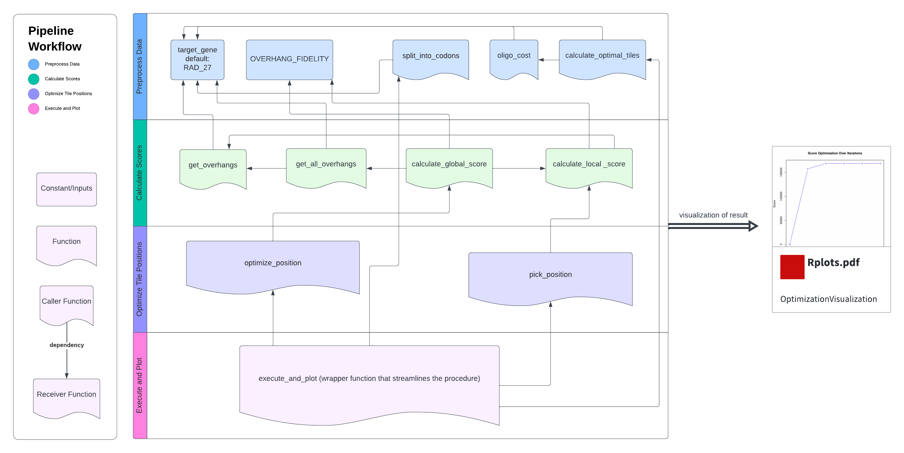

<!-- README.md is generated from README.Rmd. Please edit that file -->

```{r, include = FALSE}
knitr::opts_chunk$set(
  collapse = TRUE,
  comment = "#>",
  fig.path = "man/figures/README-",
  out.width = "100%"
)
```

# TRexDAD

A pipeline for the design of mutagenizing oligonucleotides required for Tile Region Exchange Mutagenesis (T-Rex), which is a crucial step for deep mutation scanning (DMS), by harnessing data-optimized assembly design (DAD).

<!-- badges: start -->


<!-- badges: end -->

## Description

Designing oligonucleotides is a significant part of Tile Region Exchange mutagenesis (T-Rex). It is a DNA assembly technique based on cassette mutagenesis, which utilizes a short, double-stranded oligonucleotide sequence (gene cassette) to replace a fragment of target DNA. It uses complementary restriction enzyme digest ends on the target DNA and gene cassette to achieve specificity. Here is a general overview of Tile Region Exchange and cassette mutagenesis.

However, derive the assembly design by hand is often error-prone and time-consuming since the fidelity of resulting oligonucleotides does not merely depend on mere rules. Therefore, a data-driven solution is required for designing oligonucleotides with high correct assembly rate []. Although there are web tools currently available for this procedure, few of them utilized Data-optimized Assembly Design.`TRexDAD` is a streamline tool that facilitates oligonucleotide design for Tile Region Exchange Mutagenesis by harnessing Data-optimized Assembly Design (DAD) techniques, along with visualization of optimization process. The package is targeted for researchers who perform Tile Region Exchange Mutagenesis for some genes of interest and need an efficient and reliable streamline to produce mutagenizing oligonucleotides. The scope of the R package is to improve the work flow in Tile Region Exchange Mutagenesis, facilitating open-source researches for interested bioinformatitians and computational biologists. The `TRexDAD` package was developed using `R version 4.3.1 (2023-06-16)`, `Platform: aarch64-apple-darwin20 (64-bit)` and `Running under: macOS Sonoma 14.1.1`.

## Installation

To install the latest version of the package:

``` {r}
options(repos = c(CRAN = "https://cloud.r-project.org"))
install.packages("devtools")
library("devtools")
devtools::install_github("yunyicheng/TRexDAD", build_vignettes = TRUE)
library("TRexDAD")
```

<!-- To run the Shiny app: -->

<!-- ``` r -->
<!-- runTestingPackage() # not for Assessment 4; only for Assessment 5 -->
<!-- ``` -->

## Package Overview

```{r}
ls("package:TRexDAD")
data(package = "TRexDAD") 
browseVignettes("TRexDAD")
```

`TRexDAD` contains 10 functions. Since they are all parts of an integrated pipeline, they are go to one R script, `pipeline.R`. Here are the workflow illustration and detailed explaination of them.



1.  ***execute_and_plot*** is the work flow function which wraps up most of the other functions. It performs an optimization process to determine the optimal tile positions in a gene sequence and plots the progression of the score over iterations. It provides two customization parameters: `iteration_max` and `scan_rate`. If not other specified, these parameter will have default values: `iteration_max=30`, `scan_rate=7`.

2.  ***split_into_codons*** takes a gene sequence (as a string) and splits it into codons.

3.  ***oligo_cost*** calculates the cost of oligonucleotides (oligos) based on 
the number of tiles and the number of codons.

4. ***calculate_optimal_tiles*** calculates the oligo cost for a range of tile numbers and finds the number of tiles that minimizes this cost. It also computes the global length of the tiles.

5. ***get_overhangs*** calculates the overhang sequences at the specified positions in a gene sequence. Depending on the flag, it returns these sequences as either `DNAString` objects or plain character strings.

6. ***get_all_overhangs*** computes overhang sequences for a given list of positions in a gene sequence. It iteratively calls the `get_overhangs` function to calculate the head and tail overhangs for each position and accumulates them in a list.

7. ***calculate_local_score*** calculates a score for a specific tile within a gene sequence. The score is based on palindromicity, length variation from a global standard, and on-target reactivity, using a pre-defined overhang fidelity dataframe.

8. ***calculate_global_score*** calculates a global score for a list of positions in a gene sequence. The score takes into account off-target reactions, repetitions, and the sum of local scores (by calling `obtain_score`). 

9. ***pick_position*** selects a position from a list of positions for optimization based on their scores. It uses a weighted sampling approach where the weights are inversely proportional to the scores of the positions.

10. ***optimize_position*** optimizes a single position within a list of positions. It adjusts the specified position to maximize the overall score (obtained via `calculate_scores`). The function supports different optimization modes, including greedy and Markov Chain Monte Carlo (MCMC) approaches.


## Contributions

The author of the package is Yunyi Cheng. 

The author wrote the *execute_and_plot* function, which performs an optimization process to determine the optimal tile positions in a gene sequence and plots the progression of the score over iterations. 

Other user-accessible functions are also developed by the author. Most of them serve as helper functions for the *execute_and_plot* function.

`Biostrings` R package is used for calculating reverse complement of overhangs in the *get_overhangs* function.

`readxl` R package is used for reading excel file `overhang_fidelity.xlsx` containing tested overhangs's reactivity against each other. `overhang_fidelity.xlsx` is from the study by New England Biolabs.

`forstringr` R package is used for manipulating splitted target gene (a list of codons) in the *get_overhangs* function.

The `stats` R package is used for optimizing gene tile length and number of tiles. It is used in  *calculate_optimal_tiles* function and *execute_and_plot* function. 


## References

- Pryor JM, Potapov V, Kucera RB, Bilotti K, Cantor EJ, Lohman GJS (2020). Enabling one-pot Golden Gate assemblies of unprecedented complexity using data-optimized assembly design. *PLOS ONE*, **15**(9), e0238592. [doi:10.1371/journal.pone.0238592](doi:10.1371/journal.pone.0238592)

- Potapov V, Ong JL, Kucera RB, Langhorst BW, Bilotti K, Pryor JM, Cantor EJ, Canton B, Knight TF, Evans TC Jr, Lohman GJS (2018). Comprehensive profiling of four base overhang ligation fidelity by T4 DNA ligase and application to DNA assembly. *ACS Synthetic Biology*, **7**(11), 2665–2674.

- Pagès H, Aboyoun P, Gentleman R, DebRoy S (2023). Biostrings: Efficient manipulation of biological strings. Bioconductor. [doi:10.18129/B9.bioc.Biostrings](https://doi.org/10.18129/B9.bioc.Biostrings), R package version 2.68.1, [Biostrings](https://bioconductor.org/packages/Biostrings).

- Wickham H, Bryan J (2023). readxl: Read Excel Files. R package version 1.4.3, [CRAN](https://CRAN.R-project.org/package=readxl).

- Ogundepo E (2023). forstringr: String Manipulation Package for Those Familiar with 'Microsoft Excel'. R package version 1.0.0, [CRAN](https://CRAN.R-project.org/package=forstringr).

- R Core Team (2023). R: A Language and Environment for Statistical Computing. R Foundation for Statistical Computing, Vienna, Austria. [R Project](https://www.R-project.org/).

## Acknowledgements

This package was developed as part of an assessment for 2023 BCB410H: Applied Bioinformatics course at the University of Toronto, Toronto, CANADA. 

`TRexDAD` welcomes issues, enhancement requests, and other contributions. To submit an issue, use the [GitHub issues](https://github.com/yunyicheng/TRexDAD/issues). Many thanks to those who provided feedback to improve this package.

## Workflow Usage
The main objective of the package is to find optimal assembly design in mutagenizing Rad27. The RAD27 gene of Saccharomyces cerevisiae encodes a 5′-3′ flap exo/endonuclease, which is significant for DNA replication.

To initiate workflow (with visualization of scores), run:
```{r} 
execute_and_plot()
```

## Package Structure
The package tree structure is provided below:
```r
.
|____man
| |____execute_and_plot.Rd
| |____obtain_score.Rd
| |____get_all_overhangs.Rd
| |____pick_position.Rd
| |____oligo_cost.Rd
| |____optimize_position.Rd
| |____calculate_optimal_tiles.Rd
| |____calculate_scores.Rd
| |____figures
| | |____README-unnamed-chunk-4-1.png
| |____get_overhangs.Rd
| |____split_into_codons.Rd
|____.Rbuildignore
|____vignettes
| |____vignette.R
| |____vignette.html
| |____.gitignore
| |____vignette.Rmd
|____.DS_Store
|____LICENSE
|____tests
| |____.DS_Store
| |____testthat
| | |____test-processdata.R
| |____testthat.R
|____R
| |____execution_plot.R
| |____optimize_position.R
| |____calculate_scores.R
| |____process_data.R
|____NAMESPACE
|____README.md
|____DESCRIPTION
|____.gitignore
|____TRexDAD.Rproj
|____inst
| |____.DS_Store
| |____extdata
| | |____overhang_fidelity.xlsx
|____README.Rmd
|____.Rproj.user
```

