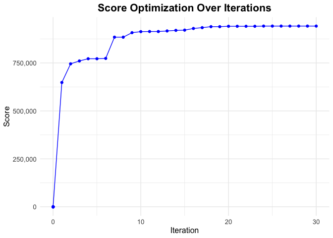

<!-- README.md is generated from README.Rmd. Please edit that file -->

# TRexDAD

A pipeline for the design of mutagenizing oligonucleotides required for
Tile Region Exchange Mutagenesis (T-Rex), which is a crucial step for
deep mutation scanning (DMS), by harnessing data-optimized assembly
design (DAD).

<!-- badges: start -->


<!-- badges: end -->

## Description

Designing oligonucleotides is a significant part of Tile Region Exchange
mutagenesis (T-Rex). However, derive the assembly design by hand is
often error-prone and time-consuming since the fidelity of resulting
oligonucleotides does not merely depend on mere rules. Therefore, a
data-driven solution is required for designing oligonucleotides with
high correct assembly rate. Although there are web tools currently
available for this procedure, few of them utilized Data-optimized
Assembly Design.`TRexDAD` is a streamline tool that facilitates
oligonucleotide design for Tile Region Exchange Mutagenesis by
harnessing Data-optimized Assembly Design (DAD) techniques, along with
visualization of the results. The package is targeted for researchers
who perform Tile Region Exchange Mutagenesis for some genes of interest
and need an efficient and reliable streamline to produce mutagenizing
oligonucleotides. The scope of the R package is to improve the work flow
in Tile Region Exchange Mutagenesis, facilitating open-source researches
for interested bioinformatitians and computational biologists. The
`TRexDAD` package was developed using `R version 4.3.1 (2023-06-16)`,
`Platform: aarch64-apple-darwin20 (64-bit)` and
`Running under: macOS Sonoma 14.1.1`.

## Installation

To install the latest version of the package:

``` r
options(repos = c(CRAN = "https://cloud.r-project.org"))
install.packages("devtools")
#> 
#> The downloaded binary packages are in
#>  /var/folders/j2/0nyw78hx65ld4h4zpmyv3r_40000gn/T//RtmpLOm6qv/downloaded_packages
library("devtools")
#> Loading required package: usethis
devtools::install_github("yunyicheng/TRexDAD", build_vignettes = TRUE)
#> Downloading GitHub repo yunyicheng/TRexDAD@HEAD
#> These packages have more recent versions available.
#> It is recommended to update all of them.
#> Which would you like to update?
#> 
#> 1: All                               
#> 2: CRAN packages only                
#> 3: None                              
#> 4: rlang     (1.1.1  -> 1.1.2) [CRAN]
#> 5: lifecycle (1.0.3  -> 1.0.4) [CRAN]
#> 6: stringi   (1.7.12 -> 1.8.1) [CRAN]
#> 
#> ── R CMD build ──────────────────────────────────────────────────────────────────────────────────────────────
#>      checking for file ‘/private/var/folders/j2/0nyw78hx65ld4h4zpmyv3r_40000gn/T/RtmpLOm6qv/remotesad567db383af/yunyicheng-TRexDAD-5afd3b1/DESCRIPTION’ ...  ✔  checking for file ‘/private/var/folders/j2/0nyw78hx65ld4h4zpmyv3r_40000gn/T/RtmpLOm6qv/remotesad567db383af/yunyicheng-TRexDAD-5afd3b1/DESCRIPTION’
#>   ─  preparing ‘TRexDAD’:
#>      checking DESCRIPTION meta-information ...  ✔  checking DESCRIPTION meta-information
#>   ─  installing the package to build vignettes
#>      creating vignettes ...  ✔  creating vignettes (6.5s)
#>   ─  checking for LF line-endings in source and make files and shell scripts
#>   ─  checking for empty or unneeded directories
#>   ─  building ‘TRexDAD_0.0.0.9000.tar.gz’
#>      
#> 
library("TRexDAD")
```

<!-- To run the Shiny app: -->
<!-- ``` r -->
<!-- runTestingPackage() # not for Assessment 4; only for Assessment 5 -->
<!-- ``` -->

## Package Overview

To list all user-accessible functions, run:

``` r
ls("package:TRexDAD")
#>  [1] "calculate_optimal_tiles" "calculate_scores"        "execute_and_plot"        "get_all_overhangs"      
#>  [5] "get_overhangs"           "obtain_score"            "oligo_cost"              "optimize_position"      
#>  [9] "pick_position"           "split_into_codons"
```

`TRexDAD` contains 10 functions.

1.  ***execute_and_plot*** is the work flow function which wraps up most
    of the other functions. It performs an optimization process to
    determine the optimal tile positions in a gene sequence and plots
    the progression of the score over iterations. It provides two
    customization parameters: `iteration_max` and `scan_rate`. If not
    other specified, these parameter will have default values:
    `iteration_max=30`, `scan_rate=7`.

2.  ***split_into_codons*** takes a gene sequence (as a string) and
    splits it into codons.

3.  ***oligo_cost*** calculates the cost of oligonucleotides (oligos)
    based on the number of tiles and the number of codons.

4.  ***calculate_optimal_tiles*** calculates the oligo cost for a range
    of tile numbers and finds the number of tiles that minimizes this
    cost. It also computes the global length of the tiles.

5.  ***get_overhangs*** calculates the overhang sequences at the
    specified positions in a gene sequence. Depending on the flag, it
    returns these sequences as either `DNAString` objects or plain
    character strings.

6.  ***get_all_overhangs*** computes overhang sequences for a given list
    of positions in a gene sequence. It iteratively calls the
    `get_overhangs` function to calculate the head and tail overhangs
    for each position and accumulates them in a list.

7.  ***obtain_score*** calculates a score for a specific tile within a
    gene sequence. The score is based on palindromicity, length
    variation from a global standard, and on-target reactivity, using a
    pre-defined overhang fidelity dataframe.

8.  ***calculate_scores*** calculates a global score for a list of
    positions in a gene sequence. The score takes into account
    off-target reactions, repetitions, and the sum of local scores (by
    calling `obtain_score`).

9.  ***pick_position*** selects a position from a list of positions for
    optimization based on their scores. It uses a weighted sampling
    approach where the weights are inversely proportional to the scores
    of the positions.

10. ***optimize_position*** optimizes a single position within a list of
    positions. It adjusts the specified position to maximize the overall
    score (obtained via `calculate_scores`). The function supports
    different optimization modes, including greedy and Markov Chain
    Monte Carlo (MCMC) approaches.

## Workflow Usage

The main objective of the package is to find optimal assembly design in
mutagenizing Rad27. The RAD27 gene of Saccharomyces cerevisiae encodes a
5′-3′ flap exo/endonuclease, which is significant for DNA replication.

To initiate workflow (with visualization of scores), run:

``` r
execute_and_plot()
#> Optimal number of tiles = 17 
#> Optimal length of tiles = 23 
#>  [1]   3  26  49  72  95 118 141 164 187 210 233 256 279 302 325 348 371 382
#> [1] "Initial positions = 3, 26, 49, 72, 95, 118, 141, 164, 187, 210, 233, 256, 279, 302, 325, 348, 371, 382"
#> [1] "Initial score = 632800"
#> [1] "Optimized target = 49"
#> [1] "Modified pos = 3, 26, 49, 72, 95, 118, 141, 164, 187, 210, 233, 256, 279, 302, 325, 348, 371, 382"
#> [1] "#iteration = 1 , current score = 632800"
#> [1] "Optimized target = 140"
#> [1] "Modified pos = 3, 26, 49, 72, 95, 118, 140, 164, 187, 210, 233, 256, 279, 302, 325, 348, 371, 382"
#> [1] "#iteration = 2 , current score = 753650"
#> [1] "Optimized target = 25"
#> [1] "Modified pos = 3, 25, 49, 72, 95, 118, 140, 164, 187, 210, 233, 256, 279, 302, 325, 348, 371, 382"
#> [1] "#iteration = 3 , current score = 839450"
#> [1] "Optimized target = 140"
#> [1] "Modified pos = 3, 25, 49, 72, 95, 118, 140, 164, 187, 210, 233, 256, 279, 302, 325, 348, 371, 382"
#> [1] "#iteration = 4 , current score = 839450"
#> [1] "Optimized target = 140"
#> [1] "Modified pos = 3, 25, 49, 72, 95, 118, 140, 164, 187, 210, 233, 256, 279, 302, 325, 348, 371, 382"
#> [1] "#iteration = 5 , current score = 839450"
#> [1] "Optimized target = 210"
#> [1] "Modified pos = 3, 25, 49, 72, 95, 118, 140, 164, 187, 210, 233, 256, 279, 302, 325, 348, 371, 382"
#> [1] "#iteration = 6 , current score = 839450"
#> [1] "Optimized target = 140"
#> [1] "Modified pos = 3, 25, 49, 72, 95, 118, 140, 164, 187, 210, 233, 256, 279, 302, 325, 348, 371, 382"
#> [1] "#iteration = 7 , current score = 839450"
#> [1] "Optimized target = 277"
#> [1] "Modified pos = 3, 25, 49, 72, 95, 118, 140, 164, 187, 210, 233, 256, 277, 302, 325, 348, 371, 382"
#> [1] "#iteration = 8 , current score = 861800"
#> [1] "Optimized target = 233"
#> [1] "Modified pos = 3, 25, 49, 72, 95, 118, 140, 164, 187, 210, 233, 256, 277, 302, 325, 348, 371, 382"
#> [1] "#iteration = 9 , current score = 861800"
#> [1] "Optimized target = 118"
#> [1] "Modified pos = 3, 25, 49, 72, 95, 118, 140, 164, 187, 210, 233, 256, 277, 302, 325, 348, 371, 382"
#> [1] "#iteration = 10 , current score = 861800"
#> [1] "Optimized target = 49"
#> [1] "Modified pos = 3, 25, 49, 72, 95, 118, 140, 164, 187, 210, 233, 256, 277, 302, 325, 348, 371, 382"
#> [1] "#iteration = 11 , current score = 861800"
#> [1] "Optimized target = 140"
#> [1] "Modified pos = 3, 25, 49, 72, 95, 118, 140, 164, 187, 210, 233, 256, 277, 302, 325, 348, 371, 382"
#> [1] "#iteration = 12 , current score = 861800"
#> [1] "Optimized target = 185"
#> [1] "Modified pos = 3, 25, 49, 72, 95, 118, 140, 164, 185, 210, 233, 256, 277, 302, 325, 348, 371, 382"
#> [1] "#iteration = 13 , current score = 874100"
#> [1] "Optimized target = 324"
#> [1] "Modified pos = 3, 25, 49, 72, 95, 118, 140, 164, 185, 210, 233, 256, 277, 302, 324, 348, 371, 382"
#> [1] "#iteration = 14 , current score = 879700"
#> [1] "Optimized target = 143"
#> [1] "Modified pos = 3, 25, 49, 72, 95, 118, 143, 164, 185, 210, 233, 256, 277, 302, 324, 348, 371, 382"
#> [1] "#iteration = 15 , current score = 880750"
#> [1] "Optimized target = 210"
#> [1] "Modified pos = 3, 25, 49, 72, 95, 118, 143, 164, 185, 210, 233, 256, 277, 302, 324, 348, 371, 382"
#> [1] "#iteration = 16 , current score = 880750"
#> [1] "Optimized target = 94"
#> [1] "Modified pos = 3, 25, 49, 72, 94, 118, 143, 164, 185, 210, 233, 256, 277, 302, 324, 348, 371, 382"
#> [1] "#iteration = 17 , current score = 881600"
#> [1] "Optimized target = 277"
#> [1] "Modified pos = 3, 25, 49, 72, 94, 118, 143, 164, 185, 210, 233, 256, 277, 302, 324, 348, 371, 382"
#> [1] "#iteration = 18 , current score = 881600"
#> [1] "Optimized target = 233"
#> [1] "Modified pos = 3, 25, 49, 72, 94, 118, 143, 164, 185, 210, 233, 256, 277, 302, 324, 348, 371, 382"
#> [1] "#iteration = 19 , current score = 881600"
#> [1] "Optimized target = 94"
#> [1] "Modified pos = 3, 25, 49, 72, 94, 118, 143, 164, 185, 210, 233, 256, 277, 302, 324, 348, 371, 382"
#> [1] "#iteration = 20 , current score = 881600"
#> [1] "Optimized target = 121"
#> [1] "Modified pos = 3, 25, 49, 72, 94, 121, 143, 164, 185, 210, 233, 256, 277, 302, 324, 348, 371, 382"
#> [1] "#iteration = 21 , current score = 882750"
#> [1] "Optimized target = 277"
#> [1] "Modified pos = 3, 25, 49, 72, 94, 121, 143, 164, 185, 210, 233, 256, 277, 302, 324, 348, 371, 382"
#> [1] "#iteration = 22 , current score = 882750"
#> [1] "Optimized target = 324"
#> [1] "Modified pos = 3, 25, 49, 72, 94, 121, 143, 164, 185, 210, 233, 256, 277, 302, 324, 348, 371, 382"
#> [1] "#iteration = 23 , current score = 882750"
#> [1] "Optimized target = 324"
#> [1] "Modified pos = 3, 25, 49, 72, 94, 121, 143, 164, 185, 210, 233, 256, 277, 302, 324, 348, 371, 382"
#> [1] "#iteration = 24 , current score = 882750"
#> [1] "Optimized target = 185"
#> [1] "Modified pos = 3, 25, 49, 72, 94, 121, 143, 164, 185, 210, 233, 256, 277, 302, 324, 348, 371, 382"
#> [1] "#iteration = 25 , current score = 882750"
#> [1] "Optimized target = 301"
#> [1] "Modified pos = 3, 25, 49, 72, 94, 121, 143, 164, 185, 210, 233, 256, 277, 301, 324, 348, 371, 382"
#> [1] "#iteration = 26 , current score = 886650"
#> [1] "Optimized target = 168"
#> [1] "Modified pos = 3, 25, 49, 72, 94, 121, 143, 168, 185, 210, 233, 256, 277, 301, 324, 348, 371, 382"
#> [1] "#iteration = 27 , current score = 889900"
#> [1] "Optimized target = 168"
#> [1] "Modified pos = 3, 25, 49, 72, 94, 121, 143, 168, 185, 210, 233, 256, 277, 301, 324, 348, 371, 382"
#> [1] "#iteration = 28 , current score = 889900"
#> [1] "Optimized target = 96"
#> [1] "Modified pos = 3, 25, 49, 72, 96, 121, 143, 168, 185, 210, 233, 256, 277, 301, 324, 348, 371, 382"
#> [1] "#iteration = 29 , current score = 894500"
#> [1] "Optimized target = 364"
#> [1] "Modified pos = 3, 25, 49, 72, 96, 121, 143, 168, 185, 210, 233, 256, 277, 301, 324, 348, 364, 382"
#> [1] "#iteration = 30 , current score = 915650"
```



## Contributions

The author of the package is Yunyi Cheng.

The author wrote the *execute_and_plot* function, which performs an
optimization process to determine the optimal tile positions in a gene
sequence and plots the progression of the score over iterations.

Other user-accessible functions are also developed by the author. Most
of them serve as helper functions for the *execute_and_plot* function.

`Biostrings` R package is used for calculating reverse complement of
overhangs in the *get_overhangs* function.

`readxl` R package is used for reading excel file
`overhang_fidelity.xlsx` containing tested overhangs’s reactivity
against each other. `overhang_fidelity.xlsx` is from the study by New
England Biolabs.

`forstringr` R package is used for manipulating splitted target gene (a
list of codons) in the *get_overhangs* function.

The `stats` R package is used for optimizing gene tile length and number
of tiles. It is used in *calculate_optimal_tiles* function and
*execute_and_plot* function.

## References

- Vladimir Potapov, Jennifer L. Ong, Rebecca B. Kucera, Bradley W.
  Langhorst, Katharina Bilotti, John M. Pryor, Eric J. Cantor, Barry
  Canton, Thomas F. Knight, Thomas C. Jr. Evans, and Gregory J. S.
  Lohman. Comprehensive Profiling of Four Base Overhang Ligation
  Fidelity by T4 DNA Ligase and Application to DNA Assembly. ACS
  Synthetic Biology, 7(11):2665–2674, 2018.

- Pagès H, Aboyoun P, Gentleman R, DebRoy S (2023). *Biostrings:
  Efficient manipulation of biological strings*.
  <doi:10.18129/B9.bioc.Biostrings>
  <https://doi.org/10.18129/B9.bioc.Biostrings>, R package version
  2.68.1, <https://bioconductor.org/packages/Biostrings>.

- Wickham H, Bryan J (2023). *readxl: Read Excel Files*. R package
  version 1.4.3, <https://CRAN.R-project.org/package=readxl>.

- Ogundepo E (2023). *forstringr: String Manipulation Package for Those
  Familiar with ‘Microsoft Excel’*. R package version 1.0.0,
  <https://CRAN.R-project.org/package=forstringr>.

- R Core Team (2023). *R: A Language and Environment for Statistical
  Computing*. R Foundation for Statistical Computing, Vienna, Austria.
  <https://www.R-project.org/>.

## Acknowledgements

This package was developed as part of an assessment for 2023 BCB410H:
Applied Bioinformatics course at the University of Toronto, Toronto,
CANADA.

`TRexDAD` welcomes issues, enhancement requests, and other
contributions. To submit an issue, use the [GitHub
issues](https://github.com/yunyicheng/TRexDAD/issues). Many thanks to
those who provided feedback to improve this package.

## Package Structure

The package tree structure is provided below:

``` r
.
|____man
| |____execute_and_plot.Rd
| |____obtain_score.Rd
| |____get_all_overhangs.Rd
| |____pick_position.Rd
| |____oligo_cost.Rd
| |____optimize_position.Rd
| |____calculate_optimal_tiles.Rd
| |____calculate_scores.Rd
| |____figures
| | |____README-unnamed-chunk-4-1.png
| |____get_overhangs.Rd
| |____split_into_codons.Rd
|____.Rbuildignore
|____vignettes
| |____vignette.R
| |____vignette.html
| |____.gitignore
| |____vignette.Rmd
|____.DS_Store
|____LICENSE
|____tests
| |____.DS_Store
| |____testthat
| | |____test-processdata.R
| |____testthat.R
|____R
| |____execution_plot.R
| |____optimize_position.R
| |____calculate_scores.R
| |____process_data.R
|____NAMESPACE
|____README.md
|____DESCRIPTION
|____.gitignore
|____TRexDAD.Rproj
|____inst
| |____.DS_Store
| |____extdata
| | |____overhang_fidelity.xlsx
|____README.Rmd
|____.Rproj.user
```
