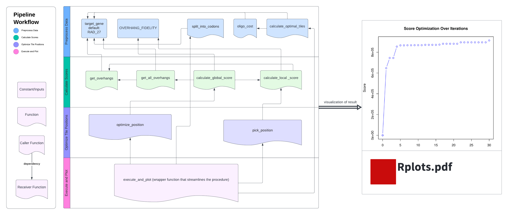

```{r, include=FALSE}
library(knitr)
library(ggplot2)
opts_chunk$set(fig.align = "center", 
               out.width = "90%",
               fig.width = 6, fig.height = 5.5,
               dev.args=list(pointsize=10),
               par = TRUE, # needed for setting hook 
               collapse = TRUE, # collapse input & ouput code in chunks
               warning = FALSE)
knit_hooks$set(par = function(before, options, envir)
  { if(before && options$fig.show != "none") 
       par(family = "sans", mar=c(4.1,4.1,1.1,1.1), mgp=c(3,1,0), tcl=-0.5)
})
set.seed(1) # for exact reproducibility
```

```{r}
require("devtools")

# Install from GitHub
devtools::install_github("yunyicheng/TRexDAD")

# Load the package
library(TRexDAD)
```

## Introduction
`TRexDAD` is a pipeline for the design of mutagenizing oligonucleotides required for Tile Region Exchange(T-Rex) Mutagenesis, which is a crucial step for deep mutation scanning (DMS), by harnessing data-optimized assembly design (DAD). DMS is a technique that combines mutagenesis, high-throughput sequencing, and functional assays to measure the effects of a large number of genetic variants on a protein's function or phenotype. In order to assess variants, generating a library of mutants is necessary. Tile Region Exchange (T-Rex) Mutagenesis is a high-throughput method to generate all possible single nucleotide variants (SNVs) or missense mutations in a gene. Here is an overview of T-Rex Mutagenesis.

`TRerxDAD` utilizes an overhang fidelity chart from a previous study to facilitate the seamless design of the mutagenizing oligos required for T-Rex. Briefly, the tool begins by assigning a score to tile locations. This score is a function of the tile sizes, whether tiles at particular positions would generate palindromic or repeating overhangs after BsaI restriction digest, and ligation fidelity as determined by New England Biolabs ([Pryor et al. (2020)](https://doi.org/10.1371/journal.pone.0238592)). In the study by New England Biolabs, the authors analyzed the propensity for a specific 4 bp overhang to ligate to all other possible 4 bp overhangs. The fraction of reads observed with correct or incorrect ligations is given in the study and forms the basis of our ligation fidelity score. Ligation fidelity is calculated by the On-Target ligation minus the Off-Target ligations to all other overhangs produced by the current tile locations. Tile locations with more desirable qualities (such as high fidelity overhangs) are given a higher score.

The optimal positions for the tile boundaries cannot be easily obtained. This is because modifying the boundaries of a single tile will strongly affect the optimality of other tiles (due to the ligation score and the tile size score). I believe that this problem reduces to the well-known clique problem in computational complexity and is therefore NP-complete (no efficient solution can be found) ([Eremin et al. (2014)](https://doi.org/10.1134/S0081543814040101)). However, finding the optimal tile positions is not compulsory; it is adequate to find decent solutions for assembly design. Thus, I developed a gradient descent algorithm that randomly 'wiggles' tile positions, accepting solutions only if they increase the global score.

## Package Overview

To list all user-accessible functions, run:
```{r}
ls("package:TRexDAD")
```

`TRexDAD` contains 11 functions. Since 10 of them are parts of an integrated 
pipeline, they are go to one R script, `pipeline.R`. The function `run_TRexDAD`
is a runner for shiny App, so it goes into `run_TRexDAD.R`.
Here are the workflow illustration and detailed explanation of the functions in
`pipeline.R`.



1.  ***execute_and_plot*** is the work flow function which wraps up most 
of the other functions. It performs an optimization process to determine 
the optimal tile positions in a gene sequence and plots the progression 
of the score over iterations. It provides two customization parameters: 
`iteration_max` and `scan_rate`. If not other specified, these parameter 
will have default values: `iteration_max=30`, `scan_rate=7`.

2.  ***split_into_codons*** takes a gene sequence (as a string) and 
splits it into codons.

3.  ***oligo_cost*** calculates the cost of oligonucleotides (oligos) based on 
the number of tiles and the number of codons.

4. ***calculate_optimal_tiles*** calculates the oligo cost for a range of
tile numbers and finds the number of tiles that minimizes this cost. It 
also computes the global length of the tiles.

5. ***get_overhangs*** calculates the overhang sequences at the specified 
positions in a gene sequence. Depending on the flag, it returns these 
sequences as either `DNAString` objects or plain character strings.

6. ***get_all_overhangs*** computes overhang sequences for a given list 
of positions in a gene sequence. It iteratively calls the `get_overhangs`
function to calculate the head and tail overhangs for each position and 
accumulates them in a list.

7. ***calculate_local_score*** calculates a score for a specific tile 
within a gene sequence. The score is based on palindromicity, length 
variation from a global standard, and on-target reactivity, using a 
pre-defined overhang fidelity dataframe.

8. ***calculate_global_score*** calculates a global score for a list of 
positions in a gene sequence. The score takes into account off-target 
reactions, repetitions, and the sum of local scores (by calling `obtain_score`). 

9. ***pick_position*** selects a position from a list of positions 
for optimization based on their scores. It uses a weighted sampling 
approach where the weights are inversely proportional to the scores of 
the positions.

10. ***optimize_position*** optimizes a single position within a list of 
positions. It adjusts the specified position to maximize the overall score 
(obtained via `calculate_scores`). The function supports different 
optimization modes, including greedy and 
Markov Chain Monte Carlo (MCMC) approaches.

## Objective
The main objective of the package is to find the optimal assembly design for 
mutagenizing a gene of interest. For illustration purposes, it is set to 
Rad27 by default; but users are encouraged to use this tool for any genes of 
interest with an ORF which is at least 60 condons in length.

## Integrative Workflow
This section breaks down the wrapper function `execute_and_plot` to illustrate
the DAD optimization process step-by-step. If you want to use specific functions
`TRexDAD` for separate usage, please refer to the section **Separate Usage**.

### 1. Initialize Global Variables

First, we need to initialize some global variables.
The first one is for assessing overhangs reactivity against each other, 
and the second one is the default target gene for illustration purposes.
```{r}
# Read overhang fidelity chart
overhang_fidelity_path <- system.file("extdata", "overhang_fidelity.csv", 
                                      package = "TRexDAD")
OVERHANG_FIDELITY <- utils::read.csv(overhang_fidelity_path)

# Example gene: RAD_27
RAD_27 <- "AATATGGGTATTAAAGGTTTGAATGCAATTATATCGGAACATGTTCCCTCTGCTATCAGGAAAAGCGATATCAAGAGCTTTTTTGGCAGAAAGGTTGCCATCGATGCCTCTATGTCTCTATATCAGTTTTTAATTGCTGTAAGACAGCAAGACGGTGGGCAGTTGACCAATGAAGCCGGTGAAACAACGTCACACTTGATGGGTATGTTTTATAGGACACTGAGAATGATTGATAACGGTATCAAGCCTTGTTATGTCTTCGACGGCAAACCTCCAGATTTGAAATCTCATGAGTTGACAAAGCGGTCTTCAAGAAGGGTGGAAACAGAAAAAAAACTGGCAGAGGCAACAACAGAATTGGAAAAGATGAAGCAAGAAAGAAGATTGGTGAAGGTTTCAAAAGAGCATAATGAAGAAGCCCAAAAATTACTAGGACTAATGGGAATCCCATATATAATAGCGCCAACGGAAGCTGAGGCTCAATGTGCTGAGTTGGCAAAGAAGGGAAAGGTGTATGCCGCAGCAAGTGAAGATATGGACACACTCTGTTATAGAACACCCTTCTTGTTGAGACATTTGACTTTTTCAGAGGCCAAGAAGGAACCGATTCACGAAATAGATACTGAATTAGTTTTGAGAGGACTCGACTTGACAATAGAGCAGTTTGTTGATCTTTGCATAATGCTTGGTTGTGACTACTGTGAAAGCATCAGAGGTGTTGGTCCAGTGACAGCCTTAAAATTGATAAAAACGCATGGATCCATCGAAAAAATCGTGGAGTTTATTGAATCTGGGGAGTCAAACAACACTAAATGGAAAATCCCAGAAGACTGGCCTTACAAACAAGCAAGAATGCTGTTTCTTGACCCTGAAGTTATAGATGGTAACGAAATAAACTTGAAATGGTCGCCACCAAAGGAGAAGGAACTTATCGAGTATTTATGTGATGATAAGAAATTCAGTGAAGAAAGAGTTAAATCTGGTATATCAAGATTGAAAAAAGGCTTGAAATCTGGCATTCAGGGTAGGTTAGATGGGTTCTTCCAAGTGGTGCCTAAGACAAAGGAACAGCTGGCTGCTGCGGCGAAAAGAGCACAAGAAAATAAAAAATTGAACAAAAATAAGAATAAAGTCACAAAGGGAAGAAGATGAGGG"

```

### 2. Splitting Gene Sequence into Codons

```{r}
gene_codons <- split_into_codons(RAD_27)
```

### 3. Calculating optimal number of tiles

```{r}
num_codons <- length(gene_codons)
tile_result <- (calculate_optimal_tiles(num_codons))
num_tile <- tile_result$optimal_num_tiles
tile_length <- tile_result$optimal_tile_length
```

### 4. Initializing tile positions
```{r}
pos <- seq(3, length(gene_codons) - 2, by = tile_length)
pos <- c(pos, length(gene_codons) - 2)
print(paste("Initial positions =", toString(pos)))
```

### 5. # Obtain initial scores
```{r}
curr_score <- calculate_global_score(gene_codons, tile_length, pos)
print(paste("Initial score =", curr_score))
```

### 6. Initialization for iterations and data for plotting
```{r}
num_iter <- 0
max_iter <- 10
x_data <- numeric(max_iter)
y_data <- numeric(max_iter)
scan_rate <- 3
```

### 7. Optimizing tile positions
```{r}
while (num_iter < max_iter) {
  # Pick a position to improve
  pick_result <- pick_position(gene_codons, tile_length, pos)
  ind <- pick_result$index
  imp <- pick_result$position
  l_bound <- max(pos[ind - 1], imp - scan_rate)
  r_bound <- min(pos[ind + 1], imp + scan_rate)
        
  # Optimize picked position
  new_imp <- optimize_position(
    gene_codons, tile_length, pos, pos[ind], l_bound, r_bound, TRUE)
  pos[ind] <- new_imp
        
  # Print optimization details
  print(paste("Optimized target =", new_imp))
  print(paste("Modified pos =", toString(pos)))
        
  # Calculate change in score and update parameters
  new_score <- calculate_global_score(gene_codons, tile_length, pos)
  curr_score <- new_score
  num_iter <- num_iter + 1
        
  # Printing iteration details
  print(paste("#iteration =", num_iter, ", current score =", curr_score))
        
  # Data for plotting
    x_data <- c(x_data, num_iter)
    y_data <- c(y_data, curr_score)
}
```

### 8. Plotting Optimization History
```{r}
# Create a ggplot  with the collected data
df <- data.frame(Iteration = x_data, Score = y_data)
plot <- ggplot2::ggplot(df, ggplot2::aes(x = Iteration, y = Score)) +
        ggplot2::geom_line(color = "blue") +
        ggplot2::geom_point(color = "blue") +
        ggplot2::labs(
            x = "Iteration", 
            y = "Score",
            title = "Score Optimization Over Iterations"
        ) +
        ggplot2::theme_minimal() +
        ggplot2::theme(
            plot.title = element_text(face = "bold", size = 16, hjust = 0.5),
            axis.title = element_text(size = 12),
            axis.text = element_text(size = 10)
        ) +
        scale_y_continuous(labels = scales::label_number(big.mark = ","))
plot
```
## Separate Usage

This section explains separate usage for each function, without using the
integrative pipeline.

### 1. Splitting Gene Sequence into Codons
```{r}
gene_codons <- split_into_codons(RAD_27)
```

### 2. Calculating Oligo Cost
```{r}
# Example: Calculate cost for 10 tiles and 100 codons
oligo_cost_example <- oligo_cost(10, 100)
```

### 3. Calculating Optimal Number of Tiles and Cost
```{r}
# Example: Calculate for 100 codons
optimal_tiles_result <- calculate_optimal_tiles(100)
```

### 4. Getting Overhang Sequences for Single Tile
```{r}
# Example: Overhangs for positions 3 and 4
overhangs_example <- get_overhangs(gene_codons, 3, 4, TRUE)
overhangs_example
```

### 5. Getting All Overhang Sequences for a List of Positions
```{r}
# Example: Overhangs for a list of positions
positions_list_example <- c(3, 5, length(gene_codons) - 2)
all_overhangs_example <- get_all_overhangs(gene_codons, positions_list_example)
all_overhangs_example
```

### 6. Calculating Local and Global Scores
```{r}
# Local score for a tile
local_score_example <- calculate_local_score(gene_codons, 5, 3, 4)
local_score_example

# Global score for a list of positions
global_score_example <- calculate_global_score(gene_codons, 5, positions_list_example)
global_score_example
```

### 7. Picking a Position for Optimization
```{r}
picked_position <- pick_position(gene_codons, 5, positions_list_example)
picked_position
```

### 8. Optimizing a Single Position
```{r}
optimized_position <- optimize_position(gene_codons, 5, positions_list_example, picked_position$position, 7, 10, TRUE)
```

### 9. Executing the Optimization Process and Plotting Results
```{r}
# This will generate a plot showing the optimization process
execute_and_plot(RAD_27, max_iter = 5, scan_rate = 2)
```
## Conclusion
This tutorial provides a comprehensive guide to using the TRexDAD package for 
T-Rex Mutagenesis design. By following these steps, you can effectively 
utilize the package to analyze and optimize gene sequences for your 
research needs.


